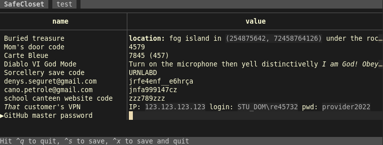

[![Latest Version][s1]][l1] [![Chat on Miaou][s2]][l2]

[s1]: https://img.shields.io/crates/v/safecloset.svg
[l1]: https://crates.io/crates/safecloset

[s2]: https://miaou.dystroy.org/static/shields/room.svg
[l2]: https://miaou.dystroy.org/3768?rust

**SafeCloset** keeps your secrets in password protected files.

# Warning

* This is a personal project
* It hasn't been audited
* It's not even finished anyway

SafeCloset comes with **absolutely** no guarantee. And I can do nothing for you if you lose the secrets you stored in SafeCloset.

# Overview

A closet is stored in a file that you can backup, keep with you on an USB key, etc.

A closet contains drawers, each one is found and open with its own password.

A drawer contains a list of (key, value). Values are texts in which you can store a code, a password, comments, a poem, some data, etc.

# Features

* The closet contains several drawers, some of them automatically created with an unknown password so that nobody can determine which drawers you're able to open, or even how many
* Each drawer is separately crypted with AES-GCM-SIV, with a random one-use nonce and the password/key of your choice. This gives an inherently long to test decrypt algorithm (but you should still use long passphrases for your drawers)
* You can have one or several drawers with real content. You can be forced to open a drawer at gun point and still keep other drawers secret without any trace
* When you open a drawer, with its password, you can read it, search it, edit it, close it
* SafeCloset automatically quits on inactivity
* The size of the drawer's content isn't observable
* No clear file is ever created, edition is done directly in the TUI (external editors are usually the weakest point)
* No clear data is ever given to any external library, widget, etc.
* All data is viewed and edited in the TUI application
* You can compile SafeCloset yourself. Its code is small and auditable and 100% in Rust
* The format of the closet file is described so that another application could be written to decode your closet files in the future (assuming you have the password)
* SafeCloset can't be queryied by other applications, like browsers. This is a feature.
* You may have all your secrets in one file easy to keep with you and backup
* No company can die and lose your secrets: you keep everything, with as many copies as necessary, where you want
* Fast and convenient to use
* Cross-platform because you don't know where you'll have to use your closet
* "I'm being watched" mode in which unselected values are hidden. This mode is kept per drawer, and always activated when you launch SafeCloset with the `--hide` option

# Non features

* SafeCloset doesn't protect you against keyloggers
* SafeCloset doesn't protect you from somebody watching your screen while a secret value is displayed (but the rest of the drawer can be kept hidden)

# Features not yet implemented

- help page with all keyboard shortcuts
- pasting (I don't think it would be a good idea to allow copying from safecloset)
- mouse selection
- password change

# Implementation details

Drawer data are serialized in MessagePack before being encrypted with AES-GCM-SIV.

MessagePack, being used with named fields, allows for the later addition of fields while keeping the compatibility with previous closet files.

The key used for this encryption is a 32 bytes Argon2 hash of the password with a closet specific salt.

# Keyboard actions

* <kbd>o</kbd> : Open a drawer
* <kbd>n</kbd> : Create a drawer (when none is open) or create a drawer entry
* <kbd>/</kbd> : Start searching the current drawer
* <kbd>esc</kbd> : Cancel current field edition
* <kbd>tab</kbd> : Create a new entry or edit the value if you're already editing an entry's name
* arrow keys: Move selection, selecting either an entry name or a value
* <kbd>i</kbd> or <kbd>insert</kbd> : Start editing the selected name or value
* <kbd>d</kbd> : Remove the selected entry
* <kbd>ctrl</kbd><kbd>q</kbd> : Quit without saving
* <kbd>ctrl</kbd><kbd>s</kbd> : Save
* <kbd>ctrl</kbd><kbd>x</kbd> : Save then quit
* <kbd>Enter</kbd> : Validate the current edition

# Advices

1. Use the search to navigate among entries. That's the most efficient solution. It's OK to have thousands of secrets in your drawer.
1. **Don't use drawers as categories**. They separate audience or security levels and ensure plausible deniability. You're supposed to have one drawer for most of your secrets. Maybe a second one if you have a *very secret* level. Or one with your work secrets that you may open with colleagues nearby. Or one for the family that even the kids can read. This shouldn't be more than 3 or 4 drawers at most.
1. Backup your closet files. They're not readable as long as your passphrases can't be guessed so you don't have to hide those files and it's most important to not lose them.
1. Use hard to guess passphrases, but ones that you can remember for a very long time.
1. You may keep the executables of all OS on your USB keys, so that you can read your secrets everywhere.
