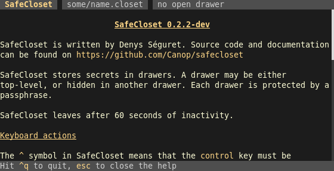
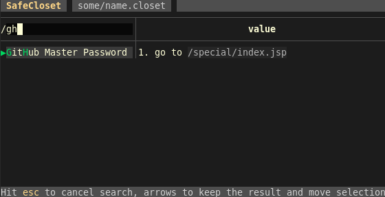

[![Latest Version][s1]][l1] [![Chat on Miaou][s2]][l2]

[s1]: https://img.shields.io/crates/v/safecloset.svg
[l1]: https://crates.io/crates/safecloset

[s2]: https://miaou.dystroy.org/static/shields/room.svg
[l2]: https://miaou.dystroy.org/3768?rust

**SafeCloset** keeps your secrets in password protected files.
**SafeCloset** is designed to be convenient and avoid common weaknesses like external editing or temporary files written on disk.


**[SafeCloset documentation](https://dystroy.org/safecloset)**

# Warning

**SafeCloset** hasn't been independently audited and comes with **absolutely** no guarantee.
And I can do nothing for you if you lose the secrets you stored in SafeCloset.

# Overview

A closet is stored in a file that you can backup, keep with you on an USB key, etc.

A closet contains drawers, each one is found and open with its own password.

A drawer contains a list of (key, value). Values are texts in which you can store a code, a password, comments, a poem, some data, etc.

A drawer can also contain deeper crypted drawers.


# Features

* The closet contains several drawers, some of them automatically created with an unknown password so that nobody can determine which drawers you're able to open, or even how many
* Each drawer is separately crypted with AES-GCM-SIV, with a random one-use nonce and the password/key of your choice. This gives an inherently long to test decrypt algorithm (but you should still use long passphrases for your drawers)
* You can have one or several drawers with real content. You can be forced to open a drawer at gun point and still keep other drawers secret without any trace, either at the top level or deeper in the drawer you opened
* When you open a drawer, with its password, you can read it, search it, edit it, close it
* In an open drawer you can create new drawers, or open deeper drawers if you know their password
* SafeCloset automatically quits on inactivity
* The size of the drawer's content isn't observable
* No clear file is ever created, edition is done directly in the TUI (external editors are usually the weakest point)
* No clear data is ever given to any external library, widget, etc.
* All data is viewed and edited in the TUI application
* You can compile SafeCloset yourself. Its code is small and auditable
* The code is 100% in Rust. I wouldn't trust anything else today for such a program
* The format of the closet file is described so that another application could be written to decode your closet files in the future (assuming you have the password)
* SafeCloset can't be queryied by other applications, like browsers. This is a feature.
* You may have all your secrets in one file easy to keep with you and backup
* No company can die and lose your secrets: you keep everything, with as many copies as necessary, where you want
* No company can be forced to add some secret stealing code: SafeCloset is small, open-source and repleacable
* Fast and convenient to use - This is where the focus of the design was
* Cross-platform because you don't know where you'll have to use your closet
* "I'm being watched" mode in which unselected values are hidden. This mode is kept per drawer, always activated when you launch SafeCloset with the `--hide` option, and toggled with <kbd>ctrl</kbd><kbd>h</kbd>

# Non features

* SafeCloset doesn't protect you against keyloggers
* SafeCloset doesn't protect you from somebody watching your screen while a secret value is displayed (but the rest of the drawer can be kept hidden)

# Usage

*Those screenshots are small, to fit here, but you may use SafeCloset full screen if you want.*

## Create your closet file

Run

```bash
safecloset some/name.closet
```


## Have a glance at the help

Hit <kbd>?</kbd> to go to the help screen, where you'll find the complete list of commands.



Hit <kbd>esc</kbd> to get back to the previous screen.

## Create your first drawer

Hit <kbd>ctrl</kbd><kbd>n</kbd>


If you want, you can create a deeper drawer there, at any time, by hitting <kbd>ctrl</kbd><kbd>n</kbd>.

Or hit <kbd>n</kbd> to create a new entry, starting with its name then hitting <kbd>tab</kbd> to go fill its value.


Change the selection with the arrow keys.
Go from input to input with the <kbd>tab</kbd> key. Or edit the currently selected field with <kbd>a</kbd>.

Reorder entries with <kbd>ctrl</kbd><kbd>🠕</kbd> and <kbd>ctrl</kbd><kbd>🠗</kbd>.

In SafeCloset, when editing, searching, opening, etc., the <kbd>enter</kbd> key validates the operation while the <kbd>esc</kbd> key cancels or closes.

You may add newlines in values with <kbd>ctrl</kbd><kbd>enter</kbd> or <kbd>alt</kbd><kbd>enter</kbd>:


*You may notice the values are rendered as Markdown.*

Don't hesitate to store hundreds of secrets in the same drawer as you'll easily find them with the fuzzy search.

Search with the <kbd>/</kbd> key:



When in the search input, remove the search with <kbd>esc</kbd>, freeze it with <kbd>enter</kbd>.

## Save and quit

Hit <kbd>ctrl</kbd><kbd>s</kbd> to save, then <kbd>ctrl</kbd><kbd>q</kbd> to quit.

## Reopen

The same command is used later on to open the closet again:

```bash
safecloset some/name.closet
```

It may be a good idea to define an alias so that you have your secrets easily available.
You could for example have this in you `.bashrc`:

```bash
function xx {
	safecloset -o ~/some/name.closet
}
```

The `-o` argument makes safecloset immediately prompt for drawer password, so that you don't have to type <kbd>ctrl</kbd><kbd>o</kbd>.

On opening, just type the password of the drawer you want to open (all will be tested until the right one opens):


# Storage format

The closet file is a [MessagePack](https://msgpack.org/index.html) encoded structure `Closet` with the following fields:

* `salt`: a string
* `drawers`: an array of `ClosedDrawer`

The MessagePack serialization preserves field names and allows future additions.

An instance of `ClosedDrawer` is a structure with the following fields:

* `id`: a byte array
* `nonce`: a byte array
* `content`: a byte array

The `content` is the AES-GCM-SIV encryption of the serializied drawer with the included `nonce`.
The key used for this encryption is a 256 bits Argon2 hash of the password with the closet's salt.

The serialized drawer is a MessagePack encoded structure with the following fields:

* `id`: a byte array
* `entries`: an array of `Entry`
* `settings`: an instance of `DrawerSettings`
* `closet`: a deeper closet, containing drawers, etc.
* `garbage`: a random byte array

Instances of `Entry` contain the following fields:

* `name`: a string
* `value`: a string

Instances of `DrawerSettings` contain for now just one optional field:

* `hide_values`: a boolean
