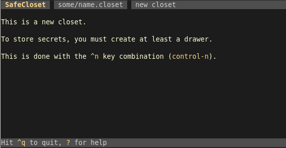
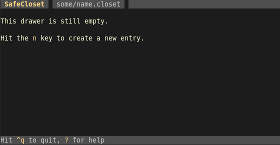
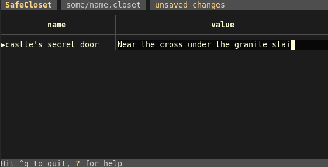
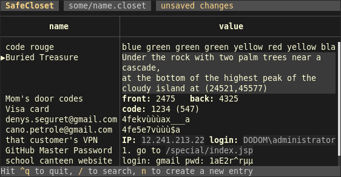
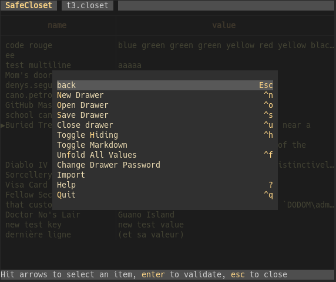

<p class=logo>

</p>

# Introduction

**SafeCloset** is a **secure**, **cross-platform**, and **convenient** secret holder, running as a terminal application without interprocess communication nor temporary files.

It stores your secrets in a **closet** file you can publicly backup, keep with you on an USB key, etc.

A closet contains **drawers**, each one is found and open with its own password.

A drawer contains a list of entries (each one being a key and a value).
Values are texts in which you can store a code, a password, comments, a poem, some data, etc.

A drawer can also contain deeper crypted drawers.

# Usage Overview

*Those screenshots are small, to fit here, but you may use SafeCloset full screen if you want.*

## Create your closet file

Run

```bash
safecloset some/name.closet
```



## Have a glance at the help

Hit <kbd>?</kbd> to go to the help screen, where you'll find the complete list of commands.


Hit <kbd>esc</kbd> to get back to the previous screen.

## Create your first drawer

Hit <kbd>ctrl</kbd><kbd>n</kbd>




If you want, you can create a deeper drawer there, at any time, by hitting <kbd>ctrl</kbd><kbd>n</kbd>.

Or hit <kbd>n</kbd> to create a new entry, starting with its name then hitting <kbd>tab</kbd> to go fill its value.



Change the selection with the arrow keys.
Go from input to input with the <kbd>tab</kbd> key. Or edit the currently selected field with <kbd>a</kbd>.

Reorder entries with <kbd>ctrl</kbd><kbd>🠕</kbd> and <kbd>ctrl</kbd><kbd>🠗</kbd>.

In SafeCloset, when editing, searching, opening, etc., the <kbd>enter</kbd> key validates the operation while the <kbd>esc</kbd> key cancels or closes.

You may add newlines in values with <kbd>ctrl</kbd><kbd>enter</kbd> or <kbd>alt</kbd><kbd>enter</kbd>:



*You may notice the values are rendered as Markdown. This is opt-in, with a toggle in the drawer's menu.*

Don't hesitate to store hundreds of secrets in the same drawer as you'll easily find them with the fuzzy search.

Search with the <kbd>/</kbd> key:


When in the search input, remove the search with <kbd>esc</kbd>, freeze it with <kbd>enter</kbd>.

## Check the menu

The menu opens on a hit on <kbd>esc</kbd>. It features the essential commands and their shortcuts:



## Save and quit

Hit <kbd>ctrl</kbd><kbd>s</kbd> to save, then <kbd>ctrl</kbd><kbd>q</kbd> to quit.

## Reopen

The same command is used later on to open the closet again:

```bash
safecloset some/name.closet
```

It may be a good idea to define an alias so that you have your secrets easily available.
You could for example have this in you `.bashrc`:

```bash
function xx {
	safecloset -o ~/some/name.closet
}
```

The `-o` argument makes safecloset immediately prompt for drawer password, so that you don't have to type <kbd>ctrl</kbd><kbd>o</kbd>.

On opening, just type the password of the drawer you want to open (all will be tested until the right one opens):


# Warning

**SafeCloset** hasn't been independently audited yet and comes with **absolutely** no guarantee.
And I can do nothing for you if you lose the secrets you stored in SafeCloset.

